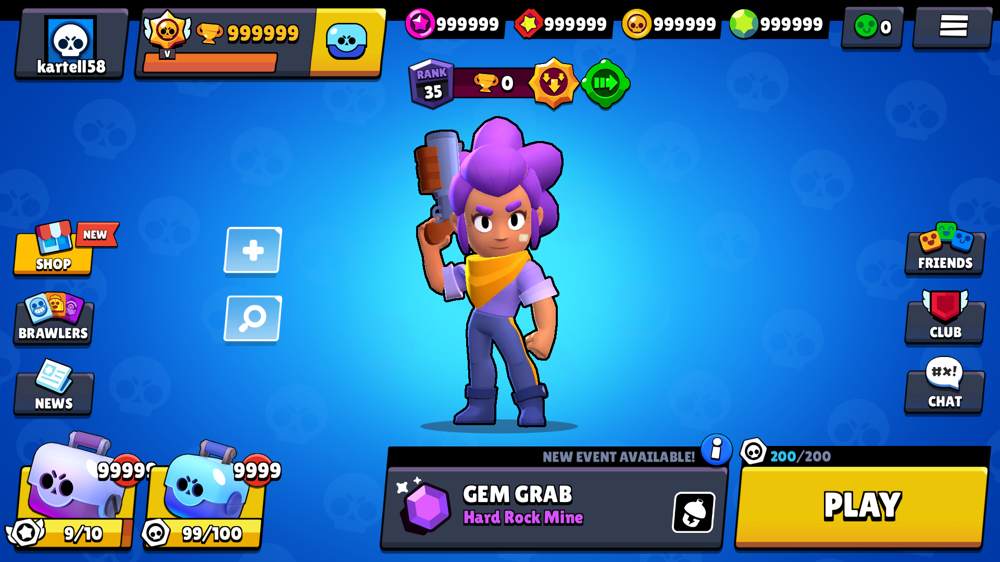

# Ragnar Stars

A Brawl Stars private server for v26.184, based on the protocol of [Classic-Brawl](https://github.com/PhoenixFire6934/Classic-Brawl/).

## Why I created this server

Classic Brawl is crap. Almost nothing works. I get where Phoenix is coming from, 
but there are simple things that could be fixed, like the fact that a player's selected character or skin isn't saved when they leave and rejoin the game.

## Client

Download the [pre-made client](https://www.mediafire.com/file/8mam98hnmu10gov/rsclient.apk/file), or compile it yourself:

```bash
sh ./tools/build-client.sh
```



# Installation

## Requirements:

- [Node.js](https://nodejs.org/en/download)
- A brain🧠...

## Setup:
- Decompile the APK
- Replace the server IP in `lib/armeabi-v7a/librs.config.so` with your own.
- Rebuild and sign the APK.
- Install the client and start the server.

> [!NOTE]
> The default values in the config file are 127.0.0.1 and 9339.
